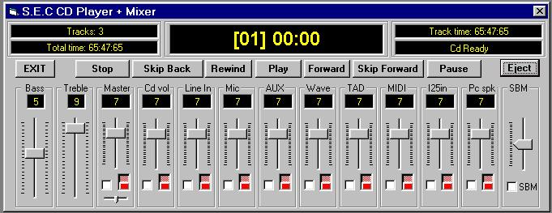



## API Cd Player and Mixer

### Description

The CD player window is a simple but effective tool for playing CDs and with the

added benefit of a mixer. The mixer enables the user to control the output of up to ten

audio devices on there computer and allowing mute, bass and treble control as well.

Also included is a SBM control for linking the selected faders together. The Cd draw is

also controlled
 
### More Info
 

             |
---                |---
**Submitted On**   |2000-05-04 01:12:04
**By**             |[Jamie Pocock](https://github.com/Planet-Source-Code/PSCIndex/blob/master/ByAuthor/jamie-pocock.md)
**Level**          |Advanced
**User Rating**    |4.6 (41 globes from 9 users)
**Compatibility**  |VB 5\.0, VB 6\.0
**Category**       |[Complete Applications](https://github.com/Planet-Source-Code/PSCIndex/blob/master/ByCategory/complete-applications__1-27.md)
**World**          |[Visual Basic](https://github.com/Planet-Source-Code/PSCIndex/blob/master/ByWorld/visual-basic.md)
**Archive File**   |[CODE\_UPLOAD5470532000\.zip](https://github.com/Planet-Source-Code/jamie-pocock-api-cd-player-and-mixer__1-7826/archive/master.zip)

